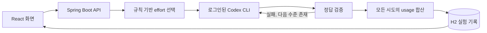

# Effort Lab 기획서

작성일: 2026-09-22 · 버전: MVP 0.1

## 1. 만들려는 제품

Effort Lab은 **AI가 작업을 해결하는 데 필요한 추론 강도를 선택하고, 실제 사용량으로 그 선택을 검증하는 앱**이다.

사용자가 작업을 입력하면 앱이 low, medium, high 중 시작 수준을 정한다. 정답을 검사할 기준이 있으면 결과를 검증하고, 실패했을 때만 수준을 높인다. 사용자는 어느 수준을 선택했는지, 왜 선택했는지, 최종적으로 몇 토큰을 사용했는지 확인한다.

첫 사용자는 Codex 구독으로 다양한 작업을 수행하는 개인 개발자다. 주 언어는 Java와 Spring Boot이며 UI는 React로 구현한다.

## 2. 문제를 정확히 정의하기

“AI가 너무 많이 생각한다”는 현상의 원인은 하나가 아니다.

- 호출 프로그램이 모든 작업에 high 또는 xhigh를 기본으로 지정할 수 있다.
- 작업의 난이도·실패 비용을 확인하지 않고 같은 설정을 반복할 수 있다.
- 답을 짧게 출력하더라도 내부 추론에 많은 토큰을 쓸 수 있다.
- 낮은 effort에서 실패한 뒤 재시도하면 오히려 전체 사용량이 늘 수 있다.
- Codex의 기본 지시문과 도구 설명 같은 고정 입력 비용이 작업 자체보다 클 수 있다.

effort는 보통 호출 클라이언트가 지정하는 설정이다. 모델이 요청 전에 스스로 선택한다고 전제하지 않는다. 또한 effort는 토큰 개수의 정확한 상한이 아니며, 낮춘다고 매번 같은 비율로 줄어들지 않는다.

## 3. 목적과 성공 기준

목적은 **정답률을 유지하면서 작업당 총토큰을 줄이는 것**이다.

핵심 지표는 세 가지다.

| 지표 | 사용 이유 |
|---|---|
| 최초 호출과 모든 재시도를 합친 총토큰 | 실패한 호출의 비용을 숨기지 않기 위해 |
| 같은 문제에 대한 정답률과 문제별 실패 | 품질을 희생한 절약을 구분하기 위해 |
| 실행 시간과 재시도 횟수 | 사용자가 체감하는 지연과 비용을 확인하기 위해 |

MVP에서는 숫자 목표를 달성한 것처럼 미리 정하지 않는다. 실제 측정으로 가능성과 한계를 먼저 확인한다.
후속 정식 평가의 잠정 목표는 업무별 독립 평가셋에서 총토큰 10% 이상 감소, 정답률 하락 2%p 이내다. 이는 **향후 합격 기준 제안**이며 이번 구현이 달성했다는 뜻이 아니다. 기준을 확정하려면 사용자의 실패 허용 수준이 필요하다.

구독 사용량에 표시된 토큰을 API 요금이나 구독의 남은 메시지 수로 환산하지 않는다.

## 4. 사용자 흐름

### 작업 스튜디오

1. 작업과 원하는 출력 형태를 입력한다.
2. 잘못된 답의 비용이 크면 ‘정확도 우선’을 켠다.
3. effort 분석을 누른다. 로컬 규칙만 실행하므로 추가 AI 토큰은 0이다.
4. 추천 effort와 근거를 확인한다.
5. 필요한 경우 검증 기준을 입력하고 Codex 구독으로 실행한다.
6. 최종 답, 각 시도, 사용 토큰을 확인한다.

‘정확도 우선’은 high로 시작하게 하는 설정이다. 정답 보장 기능은 아니다.

### 비교 실험

1. 같은 예제 문제를 세 전략에 배정한다.
2. 항상 high, 항상 low, 자동 선택을 각각 실행한다.
3. 호출 순서를 문제와 반복 횟수에 따라 순환시킨다.
4. 정답률·입력/출력/추론/캐시 토큰·실행 시간을 비교한다.
5. 실패한 문제의 응답 원문과 JSON 기록을 확인한다.

‘항상 low’를 비교군으로 둔 이유는 중요하다. 모든 문제에서 low가 충분하다면 복잡한 라우터보다 low 기본값이 나을 수 있다.

## 5. effort를 선택하는 기준

첫 버전은 설명 가능한 규칙을 사용한다.

| 신호 | 시작 수준 |
|---|---|
| 짧고 명확한 변환·추출·정렬·분류 | low |
| 계산·구현·여러 조건, 또는 단순하다는 근거 부족 | medium |
| 증명·동시성·분산·보안 등 신호 | high |
| 사용자가 정확도 우선 지정 | high |
| 긴 입력 | 길이에 따라 medium 또는 high 이상 |

강한 신호가 약한 신호보다 우선한다. “분산 문제를 요약”처럼 여러 신호가 있으면 보수적으로 high를 선택한다.

이 규칙은 작업의 의미를 완전히 이해하지 않는다. 짧은 어려운 문제, 복잡한 말로 표현한 쉬운 문제, 키워드가 우연히 들어간 텍스트에 틀릴 수 있다. UI에서는 확정 난이도나 학습된 확률 대신 시작 effort와 근거를 표시한다.

추가 모델로 난이도를 판단하지 않는 이유는, 분류 비용부터 절감 이익을 잠식할 수 있기 때문이다. 충분한 실측 데이터가 쌓인 뒤 저렴한 분류기나 학습 모델이 규칙보다 실제로 유리한지 비교한다.

## 6. 품질을 확인하고 재시도하는 방법

| 검증 방법 | 판단 범위 |
|---|---|
| 정확히 일치 | 외부에서 제공한 정답과 최종 답의 일치 |
| 필수 문자열 포함 | 요구한 문자열이 결과에 포함됐는지 |
| JSON 형식 | 객체 또는 배열로 파싱되는지 |
| 검증 없음 | 응답만 제공, 품질은 미확인 |

문자열 포함이나 JSON 파싱 성공을 일반적인 내용 정확성과 동일하게 해석하지 않는다. 코드 품질은 실행 테스트, 요약 품질은 원문 대비 평가처럼 업무별 검증기가 필요하다. 이 부분은 후속 확장 대상이다.

검증 실패 시 low → medium → high로 진행한다. high에서도 실패하면 실패로 종료한다. 정답이 없는 일반 질문은 성공으로 기록하지 않고 자동 재시도도 하지 않는다.

모델에 검증 정답을 알려주지 않는다. 모든 재시도는 원래 작업과 동일한 공통 지시문으로 실행한다. 이 방식은 재시도마다 입력 비용이 발생하므로 모두 집계한다.

## 7. 기술 구성

| 구성 | 선택 이유 |
|---|---|
| Spring Boot / Java 21 | 사용자가 익숙한 주 기술이며 프로세스 실행·API·검증·저장을 한곳에서 관리 |
| React / TypeScript / Vite | 작업 입력, 실행 상태, 비교 수치를 즉시 확인 |
| Codex CLI 어댑터 | 기존 구독 로그인으로 API 키 없이 실제 실행 |
| H2 파일 DB | 별도 DB 설치 없이 로컬 이력 유지 |
| JSONL 원본 기록 | 집계값을 원래 모델 사용량과 대조 |
| JUnit / Mockito / Playwright | 계산·예외 처리·브라우저 사용자 흐름 검증 |

앱은 한 번에 한 실행 작업만 수행한다. 실험은 비동기 작업으로 실행하고 화면에서 상태를 조회한다. 서버 재시작으로 끊긴 실험은 중단 상태로 표시하며 다시 호출해 비용을 발생시키지 않는다.

Codex 실행 시 사용자 설정을 불러오지 않고 모델과 effort를 명시한다. 인증은 기존 Codex 로그인을 사용한다. 실험은 읽기 전용 작업 폴더에서 도구를 비활성화해 수행한다. 프롬프트는 셸 문자열로 연결하지 않고 표준 입력으로 전달한다.

## 8. 이번 버전에 포함하는 기능

- 작업별 effort 선택과 판단 이유 표시
- 구독 기반 실제 모델 호출
- 외부 정답 기준의 검증과 단계별 재시도
- 세 가지 전략 비교와 호출 순서 순환
- 재시도 포함 토큰·캐시·추론·시간 집계
- 실행 중단과 호출 사이의 토큰 중단 기준
- 로컬 실험 이력, 응답 원문, JSON 내보내기
- 시뮬레이션과 실제 결과의 명확한 구분

기존 Codex 데스크톱 앱에 입력한 모든 작업을 가로채는 플러그인, 다중 사용자 서비스, 자동 과금, 모델 간 가격 최적화, 코드 실행 평가기는 이번 범위에 포함하지 않는다.

## 9. 어떻게 목적을 달성하는가

구현 차원의 작동 원리는 다음과 같다.

1. 간단한 작업의 시작 effort를 낮춰 불필요한 추론을 줄일 기회를 만든다.
2. 분류 자체에는 모델을 호출하지 않아 추가 AI 토큰을 쓰지 않는다.
3. 검증에 실패할 때만 더 높은 effort를 사용해 품질 손실을 줄인다.
4. 모든 실패 비용을 집계하여 재시도 때문에 손해가 나는 작업을 식별한다.
5. 실제 결과가 항상 low보다 못하면 그 사실도 드러내고 정책을 다시 평가한다.

**이 구조를 구현한 것과 실제 절감 효과를 입증한 것은 별개다.** 이번 관측값은 실측 보고서에 기록하고, 성과를 확인할 수 없는 범위는 달성했다고 표현하지 않는다.

## 10. 후속 개선 순서

1. 실제 사용 업무에서 최소 수백 개의 문제와 자동 검증 기준을 모은다.
2. 정책 조정용 데이터와 최종 평가용 데이터를 분리한다.
3. 모든 effort를 반복 실행하여 ‘가장 낮으면서 통과하는 effort’를 관측한다.
4. 키워드 규칙, 항상 low, 경량 분류기를 같은 기준으로 비교한다.
5. 정답률 제약을 만족하는 정책만 적용하고 입력 분포 변화 시 다시 평가한다.

특히 Codex의 고정 입력 비용이 지배적이면 effort만 낮추는 효과가 작을 수 있다. 이 경우 도구·문맥 구성, 세션 재사용, API 전용 실행 경로를 별도의 변수로 평가해야 한다.

## 근거 자료

- [OpenAI: Codex 비대화형 실행과 JSON 사용량](https://learn.chatgpt.com/docs/non-interactive-mode)
- [OpenAI: 추론 모델과 토큰 사용량](https://developers.openai.com/api/docs/guides/reasoning)
- [Spring Boot 시스템 요구 사항](https://docs.spring.io/spring-boot/system-requirements.html)
- [Vite 시작하기](https://vite.dev/guide/)
